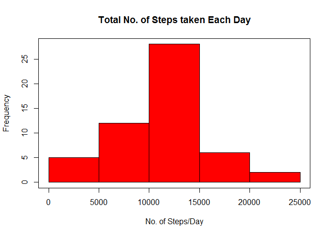
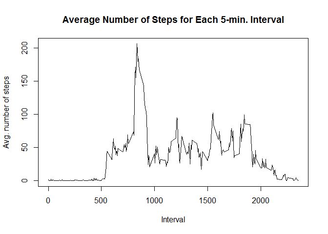
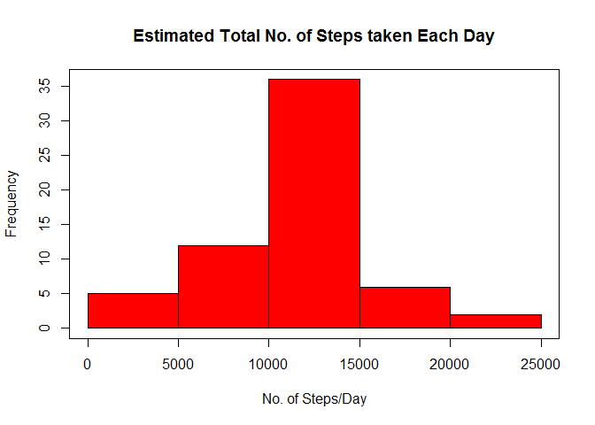

# Reproducible Research: Peer Assessment 1

## 1. Loading and preprocessing the data
This part loads and preprocesses the data.

```r
dat = read.table("activity.csv", sep=",", header = TRUE)
dat$Date2 <- as.Date(as.character(dat$date)) # add a column w/ "Date" object
```

## 2. What is mean total number of steps taken per day?
Following code does two things:  
Ignoring the missing values in the dataset,  
 a. Make a histogram of the total number of steps taken each day.  
 b. Calculate and report the mean and the median total number of steps taken per day.

```r
# a. Make a histogram of the total number of steps taken each day.
d2 <- dat[which(dat$steps != "NA"), ]  # Subset with no NA (15264 x 4)
days <- unique(d2$Date2)  # list of unique dates
# Compute the total number of steps taken each day.
dailyCt <- vector("numeric", length(days))
for (i in 1:length(days)){
    dailyCt[i] = sum(d2[which(d2$Date2 == days[i]), "steps"])
}
# Plot the histogram.	
par(bg="white")
hist(dailyCt, main="Total No. of Steps taken Each Day", col="red", xlab="No. of Steps/Day")
box()
```

 

* Values on the histogram:  5 12 28  6  2


```r
# b. Calculate and report the mean and median of daily number of steps.
mean(dailyCt)   
```

```
## [1] 10766.19
```

```r
median(dailyCt) 
```

```
## [1] 10765
```

## 3. What is the average daily activity pattern?
Following code does two things:  
 a. Make a time series plot of the 5-minute interval (x-axis) and the average number of steps taken, averaged across all days (y-axis).  
 b. Computes which 5-minute interval, on average across all the days in the dataset contains the maximum number of steps.  

```r
# a. Plot time series of the average number of steps for each interval.
# Create a time index.
tmin <- d2[which(d2$Date2 == days[1]), "interval"] # 0,5,...2355 (length 288)
# Compute the average number of steps for each interval.
avgstep <- vector("numeric", length(tmin))
for (i in 1:length(tmin)){
    avgstep[i] = mean(d2[which(d2$interval == tmin[i]), "steps"])
}
# Plot the time series of the average number of steps.
par(bg="white")
plot(tmin, avgstep, type='l', ylab="Avg. number of steps", xlab="Interval", main="Average Number of Steps for Each 5-min. Interval")
```

 

```r
# b. Find which 5-minute interval has the maximum number of steps.
max(avgstep)  # max. number of steps
```

```
## [1] 206.1698
```

```r
loc <- match(max(avgstep),avgstep) # index of max. number of steps
tmin[loc]   # 5-minute interval that has the max. number of steps
```

```
## [1] 835
```

## 4. Inputing missing values
Following code inputs missing values and draws a new histograph with data that has missing values filled in.    
 a. Calculate and report the total number of missing values in the dataset. (i.e. the total number of rows with NAs)  
 b. Strategy for filling in the missing values in the dataset: by using the mean for that 5-minute interval.  
 c. Create a new dataset that is equal to the original dataset, but with the missing data filled in.  
 d. Make a new histogram of the total number of steps taken each day, and calculate and report the mean and the median total number of steps taken per day. Compare the difference from the estimates in the first part, and note the impact of inputting missing data on the estimates of the total daily number of steps.  

```r
# a. Number of missing values in the dataset
dim(dat)[1] - dim(d2)[1]  # d2: Subset with no NA from Part 2.
```

```
## [1] 2304
```

```r
# b. Fill in missing values with 5-min interval mean.
d3 <- dat[which(is.na(dat$steps)), ]  # Subset with NA (2304 x 4)
nadays <- unique(d3$Date2)  # No. of days with NA 

# c. Create a new dataset that is equal to the original, but with missing values filled in, using the mean for that 5-minute interval.
dat2 <- dat
for (i in 1:length(nadays)){
    d3[which(d3$Date2 == nadays[i]),"steps"] <- avgstep # Subset with NA
    dat2[which(dat2$Date2 == nadays[i]),"steps"] <- avgstep # New dataset
}

# d. Draw a new histogram of the total number of steps taken each day.
daysAll <- unique(dat2$Date2)
dailyCtAll <- vector("numeric", length(daysAll)) # list of dates
# Compute the total number of steps taken each day.
for (i in 1:length(daysAll)){
	dailyCtAll[i] = sum(dat2[which(dat2$Date2 == daysAll[i]), "steps"])
}
# Plot the histogram.
par(bg="white")
hist(dailyCtAll, main="Estimated Total No. of Steps taken Each Day", col="red", xlab="No. of Steps/Day")
box()
```

 

* Values on the histogram:  5 12 36  6  2

```r
# Recalculate the mean and the median of the daily number of steps.
mean(dailyCtAll)   
```

```
## [1] 10766.19
```

```r
median(dailyCtAll) 
```

```
## [1] 10766.19
```
**Impact of inputting missing data on the estimates of the total daily number of steps:**  
* mean is the same as the mean value from Part 2.  
* median is different from the median value from Part 2.  
* mean and median are of the same value.  
* Also, there is a difference in counts for the histogram like below:  
   - Counts from Part 2 (using only available values):  5 12 28  6  2   
   - Counts from Part 4 (with missing values added in):  5 12 36  6  2

## 5. Are there differences in activity patterns between weekdays and weekends?
This section does two things:  
 a. Create a new factor variable in the dataset with two levels ??? “weekday” and “weekend” indicating whether a given date is a weekday or weekend day.  
 b. Make a panel plot containing a time series plot of the 5-minute interval (x-axis) and the average number of steps taken, averaged across all weekday days or weekend days (y-axis). 

```r
# a. Create a new factor variable in the dataset with two levels, “weekday” and “weekend”.
for (i in 1:dim(dat2)[1]){
	dayofwk <- weekdays(dat2$Date2[i])
	if ((dayofwk == "일요일") | (dayofwk == "토요일")){
		dat2$wkndID[i] <- "weekend"
	} else {
		dat2$wkndID[i] <- "weekday"
	}
}

# b. Make a panel plot containing a time series plot of the 5-minute interval (x-axis) and the average number of steps taken, for weekdays and weekends. 
# Separate into weekday and weekend data.
d_wdy <- dat2[which(dat2$wkndID == "weekday"), ]  
d_wnd <- dat2[which(dat2$wkndID == "weekend"), ]
# Compute the average for the 5-min. time intervals.
avgStepWdy <- vector("numeric", length(tmin))
avgStepWnd <- vector("numeric", length(tmin))
for (i in 1:length(tmin)){
	avgStepWdy[i] = mean(d_wdy[which(d_wdy$interval == tmin[i]), "steps"])
	avgStepWnd[i] = mean(d_wnd[which(d_wnd$interval == tmin[i]), "steps"])
}
# Form a data frame with
# - time index made with 5-min time intervals
# - 5-min interval average number of steps
# - factor indicating whether weekend or weekday
f <- rep(0:1, each=288)  # 288 : 288
f <- factor(f, labels = c("weekday", "weekend"))
totAvg <- c(avgStepWdy, avgStepWnd) # 576
tme <- c(tmin,tmin) # 576
yseries <- data.frame(tme, totAvg, f)
# Draw a panel plot.
library(lattice)
par(bg="white")
xyplot(totAvg ~ tme | f, layout = c(1,2), type='l', xlab="Interval",ylab="Number of steps") ## Plot with 2 panels
```

 
  
**Result**  
* Weekend average number of steps shows a rather evenly spread-out peaks throughout the day, with peaks occuring mainly between 8am and 8pm time frame.  
* On the other hand, the weekday plot shows a very high peak around 8:30am and much smaller peaks throughout the rest of the day. There are three relatively clear, but much smaller peaks. They occur around 12pm, 3pm, and 7pm.


